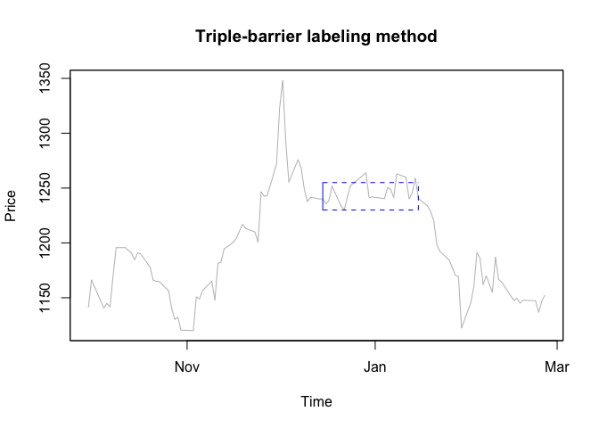

<!-- README.md is generated from README.Rmd. Please edit that file -->

finma
=====

<!-- badges: start -->

[](https://github.com/yimi97/finma/actions)
<!-- badges: end -->

The goal of `finma` is to provide a suite of functions to facilitate
machine learning in finance. Each function has a common prefix, `fl_`,
making them easy to identify. The functions in this package

-   compute price volatility,
-   define class labels for financial time series data according to the
    triple-barrier method,
-   appropriately filter financial time series data,
-   partition data into training and testing with an embargo,
-   implement a cross-validation procedure for financial time series
    data with options to purge and embargo data,
-   and more!

Installation
------------

You can install the released version of `finma` from
[CRAN](https://CRAN.R-project.org) with

``` r
install.packages("finma")
```

And the development version from [GitHub](https://github.com/) with

``` r
# install.packages("devtools")
devtools::install_github("yimi97/finma")
```

Usage
-----

``` r
library(finma)
library(tidyverse)
library(Quandl)
```

#### CUSUM filter

The CUSUM filter is a quality-control method, designed to detect a shift
in the mean value of a measured quantity away from a target value.

``` r
oil <- Quandl("NSE/OIL") %>% select(Date, Close)
oil <- zoo(oil$Close, order.by = as.Date(oil$Date))

x <- window(oil, start = "2009-09-30", end = "2012-01-01")
fl_plot_cusum(x, fl_cusum_filter(x, 100))
```


#### Triple-barrier labeling method

The triple-barrier method labels an observation according to the first
barrier touched out of three barriers. The two horizontal barriers are
defined by profit-taking and stop-loss limits, which are a dynamic
function of an estimated volatility. The third barrier is defined as an
expiration limit.

``` r
fl_get_label(x, fl_simulate_events(x), vertial_touch_label="zero") %>% 
  select(lower, upper, t1, first_touch, return, label)
#>                 lower      upper         t1 first_touch   return label
#> 2009-10-06 2009-10-07 2009-10-08 2009-10-20  2009-10-07 -0.00288    -1
#> 2009-10-07       <NA> 2009-10-08 2009-10-21  2009-10-08  0.02505     1
#> 2009-10-08       <NA> 2009-10-09 2009-10-22  2009-10-09  0.02175     1
#> 2009-10-09       <NA>       <NA> 2009-10-23  2009-10-23 -0.02589     0
#> 2009-10-12 2009-10-26       <NA> 2009-10-26  2009-10-26 -0.03287     0
#> 2009-10-14 2009-10-26       <NA> 2009-10-28  2009-10-26 -0.02860    -1
#> 2009-10-15 2009-10-26       <NA> 2009-10-29  2009-10-26 -0.02376    -1
#> 2009-10-16 2009-10-22       <NA> 2009-10-30  2009-10-22 -0.02187    -1
#> 2009-10-17 2009-10-21       <NA> 2009-10-30  2009-10-21 -0.01992    -1
#> 2009-10-20 2009-10-27       <NA> 2009-11-03  2009-10-27 -0.03184    -1
#> 2009-10-21 2009-10-27       <NA> 2009-11-04  2009-10-27 -0.02208    -1
#> 2009-10-22 2009-10-27       <NA> 2009-11-05  2009-10-27 -0.02112    -1
#> 2009-10-23 2009-10-27       <NA> 2009-11-06  2009-10-27 -0.02091    -1
#> 2009-10-26 2009-10-28       <NA> 2009-11-09  2009-10-28 -0.02266    -1
#> 2009-10-27 2009-10-30 2009-11-09 2009-11-10  2009-10-30 -0.01732    -1
#> 2009-10-28       <NA> 2009-11-04 2009-11-11  2009-11-04  0.01827     1
#>  [ reached 'max' / getOption("max.print") -- omitted 542 rows ]
```

If the upper barrier is touched first, we label the observation as 1. If
the lower barrier is touched first, we label the observation as -1. If
the vertical barrier is touched first, we have two options: `sign` and
`zero`. If `sign`, the label is decided by the sign of the asset’s
return. If `zero`, the label is set to 0.



The plot is a schematic diagram of the Triple-barrier labeling method.
The three dotted lines are two horizontal and one vertical barrier. It
is shown that the lower barrier is touched first and this observation
should be labeled 1.

#### Cross-validation

For financial time series data, which is serially correlated, the
training set contains information that appears in the testing set. This
is known as leakage. To prevent leakage, data scientists can use a
combination of purging and embargo.

``` r
label <- fl_get_label(x, fl_simulate_events(x))
cv_result <- fl_purge_cv(fl_label_index(label))
str(cv_result, max.level = 2)
#> List of 5
#>  $ :List of 3
#>   ..$ train :'data.frame':   436 obs. of  3 variables:
#>   ..$ test  :'data.frame':   111 obs. of  3 variables:
#>   ..$ purged:'data.frame':   11 obs. of  3 variables:
#>  $ :List of 3
#>   ..$ train :'data.frame':   431 obs. of  3 variables:
#>   ..$ test  :'data.frame':   111 obs. of  3 variables:
#>   ..$ purged:'data.frame':   16 obs. of  3 variables:
#>  $ :List of 3
#>   ..$ train :'data.frame':   436 obs. of  3 variables:
#>   ..$ test  :'data.frame':   111 obs. of  3 variables:
#>   ..$ purged:'data.frame':   11 obs. of  3 variables:
#>  $ :List of 3
#>   ..$ train :'data.frame':   432 obs. of  3 variables:
#>   ..$ test  :'data.frame':   111 obs. of  3 variables:
#>   ..$ purged:'data.frame':   15 obs. of  3 variables:
#>  $ :List of 3
#>   ..$ train :'data.frame':   438 obs. of  3 variables:
#>   ..$ test  :'data.frame':   114 obs. of  3 variables:
#>   ..$ purged:'data.frame':   6 obs. of  3 variables:
```

Getting help
------------

If you encounter a clear bug, please file an issue with a minimal
reproducible example on
[GitHub](https://github.com/yimi97/finma/issues).

More details on these concepts can be found in the great reference given
below.

Reference
---------

1.  Prado, M. L. (2018). Advances in financial machine learning. New
    Jersey: Wiley.
