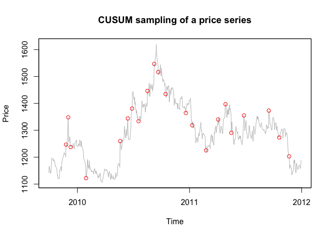

<!-- README.md is generated from README.Rmd. Please edit that file -->

finma
=====

<!-- badges: start -->

[](https://github.com/yimi97/finma/actions)
<!-- badges: end -->

The goal of finma is to process financial data and to be used for
machine learning.

Installation
------------

You can install the released version of finma from
[CRAN](https://CRAN.R-project.org) with:

``` r
install.packages("finma")
```

And the development version from [GitHub](https://github.com/) with:

``` r
# install.packages("devtools")
devtools::install_github("yimi97/finma")
```

Example
-------

``` r
library(finma)
library(tidyverse)
library(Quandl)
```

Below is three main functions in this package.

#### CUSUM filter

The CUSUM filter is a quality-control method, designed to detect a shift
in the mean value of a measured quantity away from a target value. Below
is an example shows the result of the symmetric CUSUM filter.

``` r
oil = Quandl("NSE/OIL") %>% select(Date, Close)
oil = zoo(oil$Close, order.by = as.Date(oil$Date))
x <- window(oil, start="2009-09-30", end="2012-01-01")
filtered_x <- fl_filter_symmetric_cusum(x, 100)
fl_plot_filter_result(x, filtered_x)
```



#### Triple-Barrier Labeling Method

The triple-barrier labels an observation according to the first barrier
touched out of three barriers. The two horizontal barriers are defined
by profit-taking and stop-loss limits, which are a dynamic function of
estimated volatility. The third barrier is defined as an expiration
limit. If the upper barrier is touched, we label the observation as 1.
If the lower barrier is touched, we label the observation as -1. If the
vertical barrier is touched first, we have two options, `sign` and
`zero`. If specify `sign`, the label is decided by the sign of the
return. If specify `zero`, the label is 0.

``` r
fl_get_label(x, fl_simulate_events(x), vertial_touch_label="zero")[1:10,]
#>                 lower      upper         t1 first_touch t0_price
#> 2009-10-06 2009-10-07 2009-10-08 2009-10-20  2009-10-07  1144.90
#> 2009-10-07       <NA> 2009-10-08 2009-10-21  2009-10-08  1141.60
#> 2009-10-08       <NA> 2009-10-09 2009-10-22  2009-10-09  1170.20
#> 2009-10-09       <NA>       <NA> 2009-10-23  2009-10-23  1195.65
#> 2009-10-12 2009-10-26       <NA> 2009-10-26  2009-10-26  1195.70
#> 2009-10-14 2009-10-26       <NA> 2009-10-28  2009-10-26  1190.45
#> 2009-10-15 2009-10-26       <NA> 2009-10-29  2009-10-26  1184.55
#> 2009-10-16 2009-10-22       <NA> 2009-10-30  2009-10-22  1191.00
#> 2009-10-17 2009-10-21       <NA> 2009-10-30  2009-10-21  1189.80
#> 2009-10-20 2009-10-27       <NA> 2009-11-03  2009-10-27  1177.85
#>            first_touch_price   return label
#> 2009-10-06           1141.60 -0.00288    -1
#> 2009-10-07           1170.20  0.02505     1
#> 2009-10-08           1195.65  0.02175     1
#> 2009-10-09           1164.70 -0.02589     0
#> 2009-10-12           1156.40 -0.03287     0
#> 2009-10-14           1156.40 -0.02860    -1
#> 2009-10-15           1156.40 -0.02376    -1
#> 2009-10-16           1164.95 -0.02187    -1
#> 2009-10-17           1166.10 -0.01992    -1
#> 2009-10-20           1140.35 -0.03184    -1
```

#### Cross-Validation

CV splits observations into two sets: the training set and the testing
set. For financial data, which is serially correlated, when the training
set contains information that appears in the testing set, the leakage
takes place. There are two ways to reduce the leakage, purging and
embargo. Purging is to purge from the training set that all observations
whose labels overlapped in time with those labels included in the
testing set. Embargo is to impose an embargo on training observations
after every test set.

``` r
label <- fl_get_label(x, fl_simulate_events(x))
cv_result <- fl_purge_CV(fl_get_index(label))
```

Reference
---------

-   Prado, M. L. (2018). Advances in financial machine learning. New
    Jersey: Wiley.
-   Wickham, H. (2015). R Packages: Organize, Test, Document, and Share
    Your Code (1st ed.). O’Reilly Media.
-   Wickham, H. (2019). Advanced R, Second Edition (Chapman & Hall/CRC
    The R Series) (2nd ed.). Chapman and Hall/CRC.
